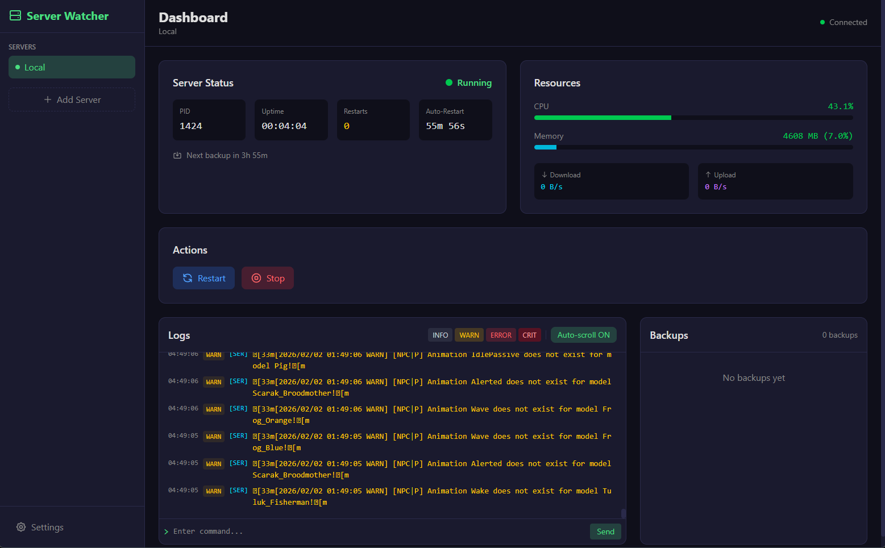

# Server Watcher

A powerful server monitoring and management desktop application built with Tauri.

**[English](#english) | [Русский](#русский)**



---

## English

### Features

- **Native Desktop App** - Cross-platform Tauri application
- **Real-time Monitoring** - CPU, RAM, Network statistics with live updates
- **Modern Dashboard** - Responsive UI with dark theme
- **System Tray** - Quick actions from system tray (restart/stop server)
- **Auto-Restart** - Automatic server restart on crash or schedule
- **Backup System** - Periodic backups with LZMA compression
- **Log Viewer** - Live log streaming with filtering
- **Telegram Notifications** - Get alerts on your phone

### Installation

#### From Source

```bash
# Clone the repository
git clone https://github.com/your-repo/server-watcher.git
cd server-watcher/others/server-watcher

# Install frontend dependencies
cd web-ui
npm install

# Build and run (development)
cd ../src-tauri
cargo tauri dev

# Build for production
cargo tauri build
```

#### Pre-built Binary

Download from [Releases](https://github.com/your-repo/server-watcher/releases).

### Configuration

Create `config-watcher.json` in the application's working directory:

```json
{
  "server": {
    "executable": "java",
    "arguments": ["-Xms4G", "-Xmx8G", "-jar", "server.jar"],
    "working_directory": "/path/to/server",
    "restart_delay_seconds": 30,
    "max_restarts": null,
    "auto_restart_hourly": false,
    "restart_warning_message": "Server will restart in 1 minute!"
  },
  "telegram": {
    "enabled": false,
    "token": "YOUR_BOT_TOKEN",
    "chat_id": "YOUR_CHAT_ID"
  },
  "resources": {
    "cpu_threshold_percent": 90.0,
    "memory_threshold_mb": 4096,
    "check_interval_seconds": 5
  },
  "error_patterns": {
    "critical": ["FATAL", "Server crashed", "OutOfMemoryError"],
    "errors": ["ERROR", "Exception"],
    "warnings": ["WARN", "Warning"]
  },
  "restart_on": {
    "critical": true,
    "errors": false,
    "warnings": false,
    "process_exit": true
  },
  "backup": {
    "enabled": true,
    "source_folder": "universe",
    "backup_folder": "backups",
    "interval_hours": 4,
    "retention_days": 10
  }
}
```

### Dashboard Features

- **Status Panel** - Server status, PID, uptime, restart count
- **Resources** - CPU/RAM usage with progress bars
- **Logs** - Live log viewer with auto-scroll
- **Backups** - List, download (save dialog), delete backups
- **Actions** - Restart/Stop server buttons
- **System Tray** - Quick access to restart/stop/quit

### System Tray

Right-click the system tray icon for quick actions:
- **Show** - Bring window to front
- **Restart Server** - Restart the monitored server
- **Stop Server** - Stop the monitored server
- **Quit** - Exit the application

### Development

```bash
# Run frontend dev server (from web-ui/)
npm run dev

# Run Tauri in dev mode (from src-tauri/)
cargo tauri dev
```

### Project Structure

```
server-watcher/
├── src-tauri/              # Tauri backend (Rust)
│   ├── src/
│   │   ├── lib.rs          # Tauri commands & setup
│   │   ├── config.rs       # Configuration
│   │   └── watcher/        # Core modules
│   │       ├── state.rs    # Shared state
│   │       ├── process.rs  # Process management
│   │       ├── backup.rs   # Backup system
│   │       ├── stats.rs    # Stats collection
│   │       └── telegram.rs # Notifications
│   ├── Cargo.toml
│   └── tauri.conf.json
└── web-ui/                 # Qwik frontend
    └── src/
        └── lib/
            └── api.ts      # Tauri invoke API
```

### License

MIT License

---

## Русский

### Возможности

- **Нативное приложение** - Кроссплатформенное Tauri приложение
- **Мониторинг в реальном времени** - CPU, RAM, сеть с живыми обновлениями
- **Современный дашборд** - Адаптивный интерфейс с тёмной темой
- **Системный трей** - Быстрые действия из трея (рестарт/стоп)
- **Авто-рестарт** - Автоматический перезапуск при падении или по расписанию
- **Система бекапов** - Периодические бекапы со сжатием LZMA
- **Просмотр логов** - Потоковые логи с фильтрацией
- **Telegram уведомления** - Получайте оповещения на телефон

### Установка

#### Из исходников

```bash
# Клонируем репозиторий
git clone https://github.com/your-repo/server-watcher.git
cd server-watcher/others/server-watcher

# Устанавливаем зависимости фронтенда
cd web-ui
npm install

# Сборка и запуск (разработка)
cd ../src-tauri
cargo tauri dev

# Сборка для продакшена
cargo tauri build
```

#### Готовый бинарник

Скачайте с [Releases](https://github.com/your-repo/server-watcher/releases).

### Конфигурация

Создайте `config-watcher.json` в рабочей директории приложения:

```json
{
  "server": {
    "executable": "java",
    "arguments": ["-Xms4G", "-Xmx8G", "-jar", "server.jar"],
    "working_directory": "/путь/к/серверу",
    "restart_delay_seconds": 30,
    "max_restarts": null,
    "auto_restart_hourly": false,
    "restart_warning_message": "Сервер перезагрузится через 1 минуту!"
  },
  "telegram": {
    "enabled": false,
    "token": "ТОКЕН_БОТА",
    "chat_id": "ID_ЧАТА"
  },
  "resources": {
    "cpu_threshold_percent": 90.0,
    "memory_threshold_mb": 4096,
    "check_interval_seconds": 5
  },
  "error_patterns": {
    "critical": ["FATAL", "Server crashed", "OutOfMemoryError"],
    "errors": ["ERROR", "Exception"],
    "warnings": ["WARN", "Warning"]
  },
  "restart_on": {
    "critical": true,
    "errors": false,
    "warnings": false,
    "process_exit": true
  },
  "backup": {
    "enabled": true,
    "source_folder": "universe",
    "backup_folder": "backups",
    "interval_hours": 4,
    "retention_days": 10
  }
}
```

### Функции дашборда

- **Панель статуса** - Статус сервера, PID, аптайм, счётчик рестартов
- **Ресурсы** - Использование CPU/RAM с прогресс-барами
- **Логи** - Просмотр логов в реальном времени
- **Бекапы** - Список, скачивание (диалог сохранения), удаление
- **Действия** - Кнопки перезапуска/остановки
- **Системный трей** - Быстрый доступ к рестарту/стопу/выходу

### Системный трей

Правый клик на иконке в трее:
- **Show** - Показать окно
- **Restart Server** - Перезапустить сервер
- **Stop Server** - Остановить сервер
- **Quit** - Выйти из приложения

### Разработка

```bash
# Запуск фронтенд сервера (из web-ui/)
npm run dev

# Запуск Tauri в режиме разработки (из src-tauri/)
cargo tauri dev
```

### Структура проекта

```
server-watcher/
├── src-tauri/              # Tauri бекенд (Rust)
│   ├── src/
│   │   ├── lib.rs          # Tauri команды и настройка
│   │   ├── config.rs       # Конфигурация
│   │   └── watcher/        # Основные модули
│   │       ├── state.rs    # Общее состояние
│   │       ├── process.rs  # Управление процессом
│   │       ├── backup.rs   # Система бекапов
│   │       ├── stats.rs    # Сбор статистики
│   │       └── telegram.rs # Уведомления
│   ├── Cargo.toml
│   └── tauri.conf.json
└── web-ui/                 # Qwik фронтенд
    └── src/
        └── lib/
            └── api.ts      # Tauri invoke API
```

### Лицензия

MIT License
